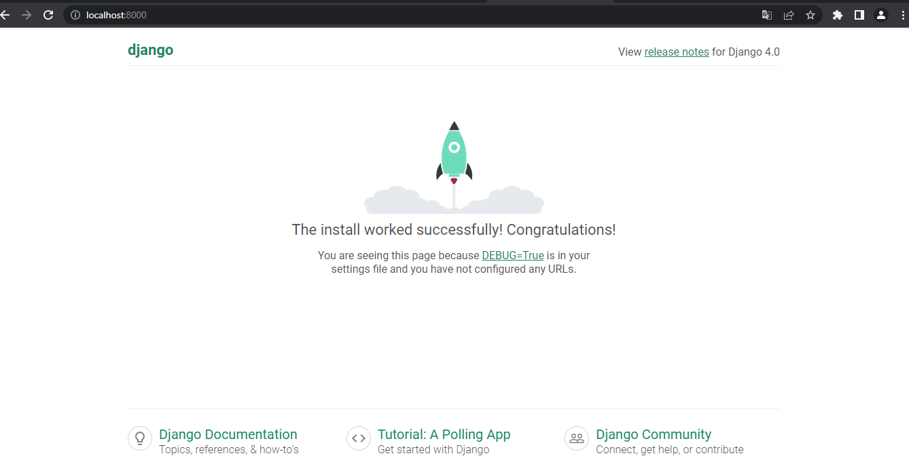

# Verificar versión de python
```
python --version
```

# Verificar versión pip (gestor de librerias de python)
```
pip  --version
```

_______________________
# Instalación VIRTUALENV (Enterno de desarrollo virtual)
pip install virtualenv

_______________________
# En proyecto gitlab crear archivo .gitignore
# en la carpeta raiz
```
nano .gitignore
```

# Contenido .gitignore
*/env/
env/

# Grabar con control + o y salir con control + x

_______________________
# Crear entorno virtual con siguiente comando.
virtualenv env

# Donde env es el nombre de la carpeta a crear.
_______________________

# cargar entorno virtual en terminal.
#Opción ejecutar los siguientes comando con 
# gitbash
cd env/Scripts
. activate
cd ../../

#Opción 2 
. env/Scripts/activate

_______________________
# Instalar Django en entorno virtual
pip install Django

# Crear proyecto en carpeta raiz
django-admin startproyect pets_nico

# Donde pets_nico es nombre del proyecto

# ingresar a la carpeta pets_nico
cd pets_nico

# iniciar servidor django
python manage.py runserver 8000

# Donde 8000 es el puerto de la aplicación web

